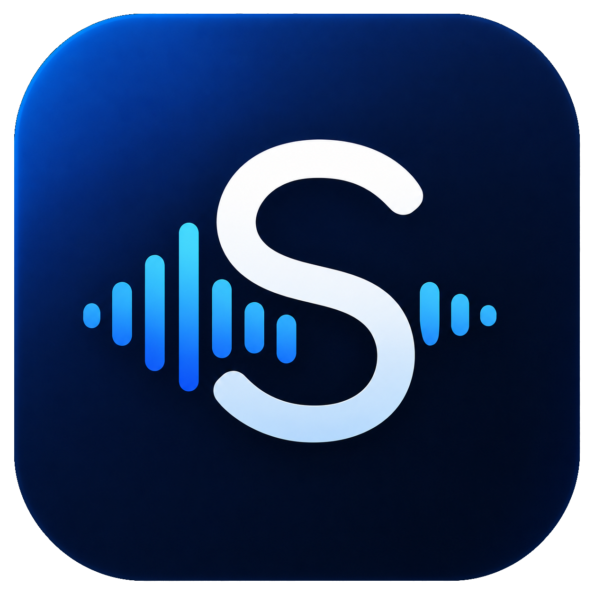
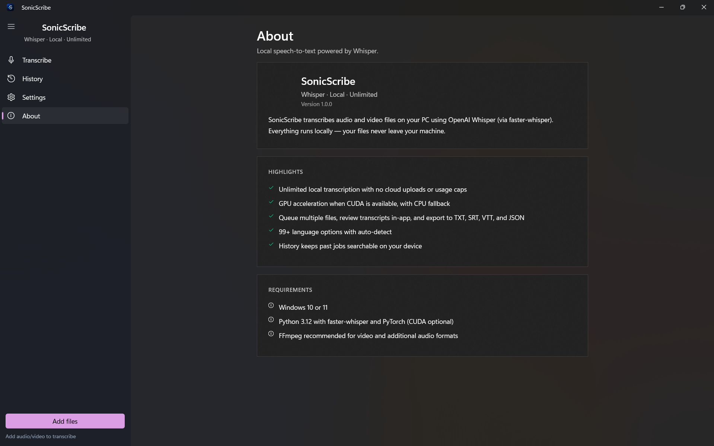

<p align="center">
  
</p>

<h1 align="center">SonicScribe</h1>

<p align="center">
  <strong>Local speech-to-text for Windows — private, unlimited, GPU-accelerated.</strong>
</p>

<p align="center">
  <a href="https://github.com/aadiichau/SonicScribe/releases/latest">
    
  </a>
  
  
  
  
</p>

<p align="center">
  Transcribe audio and video on your own PC with <a href="https://github.com/SYSTRAN/faster-whisper">faster-whisper</a>.
  No cloud. No accounts. No usage caps.
</p>

---

<p align="center">
  
</p>

---

## Download

| Package | Description |
|---------|-------------|
| [**Installer (recommended)**](https://github.com/aadiichau/SonicScribe/releases/latest/download/SonicScribe-Setup-v1.0.5.exe) | `SonicScribe-Setup-v1.0.5.exe` — install like a normal Windows app |
| [**Portable zip**](https://github.com/aadiichau/SonicScribe/releases/latest/download/SonicScribe-v1.0.5-Portable-win-x64.zip) | Unzip anywhere → run `SonicScribe.exe` (no install) |

| | |
|---|---|
| **Installer size** | ~70 MB |
| **Platform** | Windows 10/11, 64-bit (version 1809 or later) |

### Install with the setup exe (recommended)

1. Download **`SonicScribe-Setup-v1.0.5.exe`**
2. Run the installer → Next → Install
3. Launch from Start Menu (optional desktop shortcut)
4. Install Python prerequisites (below) on first use

### Or use portable zip

1. Download the portable zip and unzip
2. Run `SonicScribe.exe` or `Start SonicScribe.bat`
3. Keep all files in the folder together

> **Note:** SonicScribe cannot be a single tiny `.exe` — WinUI needs ~200 MB of libraries. The **installer** is one download that sets everything up in `Program Files`.

---

## Features

| Feature | Description |
|---------|-------------|
| **Fully local** | Audio never leaves your machine |
| **GPU accelerated** | NVIDIA CUDA support with automatic CPU fallback |
| **99+ languages** | Auto-detect or pick a language manually |
| **Batch queue** | Drop multiple files and process them in order |
| **In-app review** | Read transcripts with optional timestamps |
| **Exports** | TXT, SRT, VTT, and JSON |
| **History** | Search and revisit past transcriptions |

**Supported formats:** MP3, MP4, WAV, M4A, FLAC, MKV, WEBM, and more (FFmpeg recommended for video).

---

## Prerequisites

SonicScribe is a desktop shell around Whisper. On first launch, use **Install everything** in Settings (or accept the setup prompt) to automatically install Python, faster-whisper, PyTorch, and FFmpeg.

### 1. Python 3.11 or 3.12

Download from [python.org](https://www.python.org/downloads/) and check **"Add Python to PATH"** during install.

### 2. Whisper + PyTorch

**NVIDIA GPU (recommended):**

```powershell
pip install faster-whisper torch torchvision torchaudio --index-url https://download.pytorch.org/whl/cu124
```

**CPU only:**

```powershell
pip install faster-whisper torch torchvision torchaudio
```

### 3. FFmpeg (recommended for video)

```powershell
winget install Gyan.FFmpeg
```

### 4. First launch (automatic — recommended)

On first launch, SonicScribe offers **Install everything**. Or go to **Settings → Automatic Setup → Install everything**.

This installs Python 3.12, faster-whisper, PyTorch (GPU if NVIDIA detected), and FFmpeg via `winget` + `pip`. First run can take 10–30 minutes.

### Manual setup (optional)

If you prefer manual install, use the commands below, then **Settings → Auto-detect Python → Re-detect GPU**.

---

## Quick start

```
1. Download SonicScribe-win-x64.zip from Releases
2. Unzip to Desktop\SonicScribe (or anywhere)
3. Install Python packages (see above)
4. Double-click SonicScribe.exe
5. Drop an audio/video file → Start
```

Transcripts save to `Documents\SonicScribe\Outputs\`.

---

## Build from source

For developers who want to compile locally:

**Requirements:** Windows 10/11, [.NET 8 SDK](https://dotnet.microsoft.com/download)

```powershell
git clone https://github.com/aadiichau/SonicScribe.git
cd SonicScribe
.\publish.ps1
```

Output: `dist\SonicScribe\SonicScribe.exe`

---

## Project structure

```
SonicScribe/
├── LocalScribe/              # WinUI 3 app (C#)
│   ├── Engine/               # Python Whisper worker
│   ├── Views/                # UI pages
│   └── Assets/               # App icons
├── publish.ps1               # Build standalone release
├── release.ps1               # Build + zip for GitHub Releases
└── scripts/generate_icons.py # Regenerate icons from PNG
```

---

## Data & privacy

| Data | Location |
|------|----------|
| Transcript exports | `%USERPROFILE%\Documents\SonicScribe\Outputs\` |
| Settings & history | `%LOCALAPPDATA%\SonicScribe\` |

Everything stays on your computer. No telemetry, no cloud API calls for transcription.

---

## Troubleshooting

### App won't open / nothing happens when I double-click

1. **Download v1.0.5 or later** — older builds required the Windows App Runtime to be installed separately. v1.0.1+ bundles it.
2. **Use the installer or keep the portable folder intact** — do not move `SonicScribe.exe` out of its folder; it needs the DLLs beside it.
3. **Check crash logs** — if startup fails, open `%LOCALAPPDATA%\SonicScribe\logs\crash.log`.
4. **Requirements** — 64-bit Windows 10 (1809+) or Windows 11. 32-bit Windows is not supported.

### Transcription fails (app opens but won't transcribe)

That usually means Python or faster-whisper is missing. See **Prerequisites** above and use **Settings → Auto-detect Python**.

---

## Contributing

Issues and pull requests are welcome. For bugs, include your Windows version, GPU model, Python version, and the file type you tried to transcribe.

---

## License

[MIT](LICENSE) — free to use, modify, and share.

---

<p align="center">
  <sub>Built with WinUI 3 · faster-whisper · OpenAI Whisper</sub>
</p>