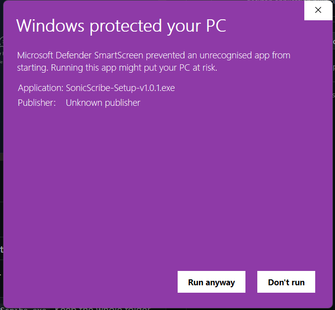

<p align="center">
  
</p>

<h1 align="center">SonicScribe</h1>

<p align="center">
  Local speech-to-text for Windows — private, unlimited, runs on your GPU.<br/>
  <sub>Whisper · Local · Unlimited</sub>
</p>

<p align="center">
  <a href="https://github.com/aadiichau/SonicScribe/releases/latest">Download latest release</a>
  ·
  <a href="https://github.com/aadiichau">@aadiichau</a>
</p>

---

<p align="center">
  
</p>

Drop audio or video files, hit Start, read the transcript. Built on [faster-whisper](https://github.com/SYSTRAN/faster-whisper). Your files never leave your PC.

---

## Download

Grab the **[latest release](https://github.com/aadiichau/SonicScribe/releases/latest)** (Windows 10/11, 64-bit).

| File | Notes |
|------|-------|
| `SonicScribe-Setup-v1.0.1.exe` | Installer (~70 MB). Adds Start Menu entry + uninstaller. |
| `SonicScribe-v1.0.1-Portable-win-x64.zip` | No install — unzip and run `SonicScribe.exe`. Keep the whole folder together. |

---

## Windows blocked the installer?

You might see a purple **Windows protected your PC** screen saying *Unknown publisher*. That happens because SonicScribe is open-source and not signed with a commercial code-signing certificate (those run a few hundred bucks a year).

The app is safe — you can read every line of the source on this repo. To install:

1. On the SmartScreen popup, click **More info** (if you see it)
2. Click **Run anyway**



Same deal if Windows warns about `SonicScribe.exe` from the portable zip. **Run anyway** is fine.

Don't want to deal with it? Use the **portable zip** instead of the `.exe` installer.

---

## First-time setup

SonicScribe still needs Python + faster-whisper before it can transcribe.

1. Open SonicScribe
2. Tap **Install everything** when prompted (or **Settings → Install everything**)
3. Wait — first setup can take 10–30 minutes depending on your internet
4. Drop a file, pick a model if you want, press **Start**

The first transcription downloads the Whisper model (up to ~3 GB for large-v3). There's a progress bar. If the percent sits still for a few minutes, don't panic — large downloads come in bursts.

### Manual setup

Python 3.11 or 3.12 from [python.org](https://www.python.org/downloads/) — check **Add to PATH**.

**NVIDIA GPU:**
```powershell
pip install faster-whisper torch torchvision torchaudio --index-url https://download.pytorch.org/whl/cu124
```

**CPU only:**
```powershell
pip install faster-whisper torch torchvision torchaudio
```

**Video (optional):**
```powershell
winget install Gyan.FFmpeg
```

Then **Settings → Auto-detect Python → Re-detect GPU → Save**.

---

## Features

- Local transcription — no cloud, no account, no caps
- GPU acceleration (CUDA) with CPU fallback
- Model picker on the Transcribe page (large-v3, medium, small, base)
- 99+ languages, auto-detect supported
- Queue multiple files
- Export TXT, SRT, VTT, JSON
- Searchable history

**Formats:** MP3, MP4, WAV, M4A, FLAC, MKV, WEBM, and more.

**Where stuff is saved:**
- Transcripts → `Documents\SonicScribe\Outputs` (or `%LocalAppData%\SonicScribe\Outputs` if Documents isn't available)
- Settings/history → `%LocalAppData%\SonicScribe`

---

## Build it yourself

Needs [.NET 8 SDK](https://dotnet.microsoft.com/download) on Windows.

```powershell
git clone https://github.com/aadiichau/SonicScribe.git
cd SonicScribe
.\publish.ps1
```

Output lands in `dist\SonicScribe\`.

---

## Something broke?

| Problem | Fix |
|---------|-----|
| App won't open | Don't move `SonicScribe.exe` out of its folder. Check `%LocalAppData%\SonicScribe\logs\crash.log`. |
| Won't transcribe | Run **Install everything** in Settings, or install Python packages manually. |
| `Could not find file ... Outputs` | Update to v1.0.1+. Or create `Documents\SonicScribe\Outputs` yourself. |
| `model.bin` error | Update to v1.0.2+ (auto-fixes and re-downloads). Or click **Repair model & retry**. Manual fix: delete `%USERPROFILE%\.cache\huggingface\hub\models--Systran--faster-whisper-large-v3`, then restart the app. |

---

## License

MIT — [LICENSE](LICENSE)

Built by [Aditya Chauhan](https://github.com/aadiichau).